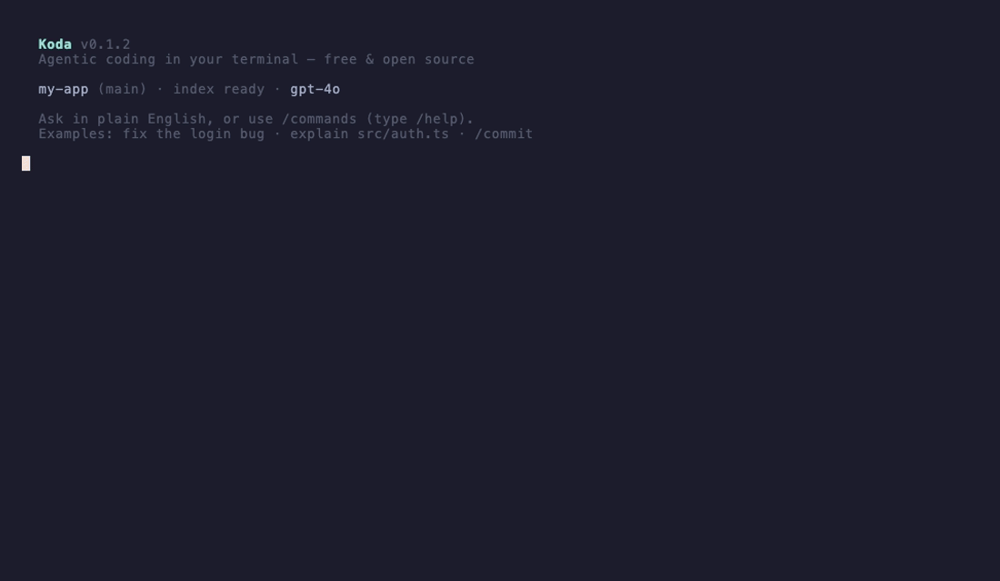

# Koda

**An autonomous AI software engineer for your codebase.**

Koda indexes your repository, reasons over code with your AI provider, and executes multi-agent workflows to build features, fix bugs, and refactor code — all from the terminal. It operates in a conversational loop, verifies its own output, and asks before doing anything destructive.

[](https://github.com/varunbiluri/koda/actions/workflows/ci.yml)
[](https://nodejs.org)
[](LICENSE)

---



---

## Contents

- [Installation](#installation)
- [Quick start](#quick-start)
- [How it works](#how-it-works)
- [Commands](#commands)
- [Configuration](#configuration)
- [Safety model](#safety-model)
- [IDE integration](#ide-integration)
- [Background agents](#background-agents)
- [Architecture](#architecture)
- [Development](#development)
- [Contributing](#contributing)

---

## Installation

**Requirements:** Node.js 18+

```bash
npm install -g @varunbilluri/koda
```

### Build from source

```bash
git clone https://github.com/varunbiluri/koda
cd koda
pnpm install     # requires pnpm 10+
pnpm build
pnpm link --global
```

---

## Quick start

```bash
# 1. Index your repository (run once per project)
koda init

# 2. Configure your AI provider
koda login

# 3. Start the conversational session
koda
```

Once the session is running, type in plain English:

```
> explain how the authentication middleware works
> add a rate-limit endpoint to the API router
> fix the session token expiry bug
> refactor the database layer to use connection pooling
```

Koda will search your codebase, plan the work, write code, run verification (tests + type-check + lint), and ask before committing anything.

---

## How it works

```
Your request
    │
    ▼
Intent detection          ← classify: explain / build / fix / refactor / search
    │
    ▼
Repository search         ← TF-IDF + symbol index retrieval
    │
    ▼
Task routing              ← SIMPLE → chat | MEDIUM → plan executor | COMPLEX → agent graph
    │
    ├─ SIMPLE ─▶  ReasoningEngine.chat()   ← single-turn AI response
    │
    ├─ MEDIUM ─▶  PlanExecutor             ← sequential plan steps
    │               │
    │               └─▶ VerificationLoop   ← tests · type-check · lint → retry on fail
    │
    └─ COMPLEX ─▶ GraphScheduler           ← parallel agent DAG
                    │
                    ├─▶ CodingAgent
                    ├─▶ TestAgent
                    ├─▶ RefactorAgent
                    └─▶ VerificationAgent
```

Every file write goes through a **permission gate** and every set of changes can be previewed as a unified diff before being applied.

---

## Commands

### Conversational session

| Command | Description |
|---------|-------------|
| `koda` | Start interactive session (natural language) |
| `koda repl` | Start REPL mode |

### Indexing

| Command | Description |
|---------|-------------|
| `koda init` | Index the repository (AST parse + TF-IDF embed) |
| `koda status` | Show index statistics |
| `koda index-status` | Show shard and worker status |

### AI tasks

| Command | Description |
|---------|-------------|
| `koda ask <question>` | Ask a question about the codebase |
| `koda explain <symbol>` | Deep explanation of a symbol |
| `koda build <task>` | Build a new feature |
| `koda fix <task>` | Fix a bug |
| `koda refactor <task>` | Refactor code |
| `koda review` | Code quality and security analysis |
| `koda test` | Find untested functions, generate test scaffolding |

### Planning & orchestration

| Command | Description |
|---------|-------------|
| `koda plan <task>` | Generate an execution plan |
| `koda graph <task>` | Generate a task dependency graph |
| `koda improve` | Run all background agents, show patch preview |

### AI provider

| Command | Description |
|---------|-------------|
| `koda login` | Configure provider credentials interactively |
| `koda models` | List available models |
| `koda use <model>` | Switch to a different model |
| `koda config` | Show or update configuration |

### Symbol intelligence

| Command | Description |
|---------|-------------|
| `koda symbols <query>` | Search the symbol index |
| `koda skills` | List and manage skills |
| `koda workers` | Show distributed worker status |

### Developer platform

| Command | Description |
|---------|-------------|
| `koda watch` | Watch for file changes, run background agents |
| `koda start-lsp` | Start LSP server (for editor integrations) |

### Observability

| Command | Description |
|---------|-------------|
| `koda history` | View past executions |
| `koda replay` | Replay a past execution |
| `koda doctor` | Run health checks |

---

## Configuration

Run `koda login` to configure interactively. Koda prompts for your provider, endpoint, API key, and lets you pick a model with arrow keys. Config is stored in `.koda/config.json` at the repository root.

```json
{
  "provider": "azure",
  "endpoint": "https://your-resource.openai.azure.com",
  "apiKey": "...",
  "model": "gpt-4o",
  "apiVersion": "2024-05-01-preview"
}
```

Supported providers: **Azure AI Foundry**, **OpenAI**, **Anthropic**, **Ollama**.

Switch models without re-entering credentials:

```bash
koda use gpt-4o-mini
```

---

## Safety model

Koda operates on a three-tier consent model. Every operation is classified before execution:

| Tier | Examples | Behaviour |
|------|----------|-----------|
| **ALLOW** | `read_file`, `search_code`, `git_log`, `git_status` | Auto-approved, no prompt |
| **ASK** | `write_file`, `edit_file`, `git_commit`, `run_terminal` | Prompts for approval |
| **DENY** | `rm -rf`, `git push --force`, `sudo`, `DROP TABLE` | Blocked unconditionally |

Additional safeguards:

- **Patch-based edits** — all file changes are unified diffs, never blind overwrites
- **Diff preview** — `koda improve` shows every change before applying
- **Verification loops** — after each agent iteration, runs `tsc`, `pnpm test`, and linting; retries on failure
- **Worktree isolation** — complex tasks run in a separate git worktree (`feature/koda-*`) so your working tree stays clean
- **File locking** — prevents concurrent agent modifications to the same file
- **Token budgets** — configurable per-agent and global token limits stop runaway usage
- **Path escaping checks** — agents cannot write files outside the repository root
- **Output limits** — tool outputs are capped in size before being fed back to the AI

In non-interactive environments (CI, pipes) all `ASK`-tier operations are auto-approved.

---

## IDE integration

Start the LSP server:

```bash
koda start-lsp
```

The server speaks JSON-RPC over stdio and supports:

- **Hover** — symbol type, documentation, and AI explanation at cursor
- **Go-to-definition** — backed by the Koda symbol index
- **Find references** — callers and usages across the repo
- **Workspace symbol search** — fuzzy match across all indexed symbols
- **Code actions** — Explain Code, Refactor, Generate Tests, Optimize File

The bundled VS Code extension (`extensions/vscode/`) connects automatically. For other editors, point your LSP client at `koda start-lsp`.

---

## Background agents

`koda watch` starts a file-system watcher and dispatches background agents as you work:

| Agent | Trigger | What it does |
|-------|---------|-------------|
| `test-coverage-agent` | File save | Identifies functions lacking test coverage |
| `security-scan-agent` | File save · commit | OWASP-style vulnerability scan |
| `performance-analysis-agent` | Git commit | Detects O(n²) loops, memory leaks, blocking I/O |
| `dead-code-agent` | Pull request | Finds unused exports and unreachable code |

Results are written to `.koda/background-results/` and shown inline in the terminal.

---

## Architecture

```
src/
├── ai/               # Providers (Azure / OpenAI / Anthropic / Ollama), reasoning engine,
│                     # context budget manager, conversation summarizer
├── agents/           # 20+ agent implementations — supervisor, coding, test, refactor,
│                     # docs, security, verification, repository explorer
├── background/       # Background agent manager and task scheduler
├── budget/           # Per-agent and global token budget management
├── cli/              # Commander.js commands, interactive session, intent detector
├── context/          # Conversation summarization and context compression
├── distributed/      # Worker manager and task dispatcher
├── engine/           # Tree-sitter AST parsing (TypeScript, JavaScript, Python),
│                     # TF-IDF embedding, chunking, file discovery
├── execution/        # Multi-agent execution engine, graph scheduler, plan executor,
│                     # failure analyzer, verification engine
├── hierarchy/        # Hierarchical supervisor / coordinator / router
├── indexing/         # Incremental indexer, shard manager, worker pool
├── lsp/              # LSP server (stdio JSON-RPC), hover, symbols, code actions
├── memory/           # Workspace memory, conversation store, execution history,
│                     # learning engine
├── observability/    # Execution tracker, event logger
├── orchestrator/     # Agent registry, wave scheduler, task decomposer, task router
├── patch/            # Diff generation and application
├── planning/         # Task graph builder, tool planner
├── preview/          # Patch preview workflow, terminal and markdown diff renderer
├── runtime/          # Permission gate, worktree manager, sandbox, command executor,
│                     # tool result index
├── search/           # Query engine (TF-IDF), semantic search, hybrid retrieval
├── security/         # Permission manager
├── skills/           # Skill registry and executor
├── store/            # Index and vector store persistence
├── summaries/        # File and symbol summarization
├── symbols/          # Symbol index, extractor, and call graph
├── tools/            # 22 AI-callable tools: filesystem, git, terminal, web, edit
├── watcher/          # File system event service and typed event bus
└── extensions/vscode # VS Code extension (LanguageClient)
```

### Tool registry

The AI has access to 22 tools at runtime:

| Category | Tools |
|----------|-------|
| Filesystem | `read_file` · `write_file` · `edit_file` · `list_files` · `search_files` |
| Code search | `search_code` · `grep_code` |
| Repository | `repo_explorer` · `list_directory` |
| Git | `git_branch` · `git_status` · `git_diff` · `git_log` · `git_add` · `git_commit` · `git_push` · `git_create_pr` |
| Terminal | `run_terminal` |
| Web | `fetch_url` |
| Patch | `apply_patch` |
| Koda commit | `koda_commit` |

All tools check permissions before executing.

---

## Development

```bash
pnpm build        # TypeScript compile — zero errors required
pnpm test         # Run all 1000+ tests with Vitest
pnpm dev          # Run via tsx (no compile step)
```

Run a subset of tests:

```bash
pnpm test tests/lsp/
pnpm test tests/background/
pnpm test tests/cli/session/
pnpm test tests/agents/
pnpm test tests/unit/
```

CI runs on Node 18, 20, and 22.

---

## Contributing

See [CONTRIBUTING.md](CONTRIBUTING.md) for the full guide.

Bug reports → [GitHub Issues](https://github.com/varunbiluri/koda/issues)

---

## License

[ISC](LICENSE)
