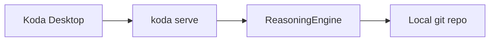

# Koda Desktop — macOS & Windows

**Local-first AI engineering workspace.** Codex-style agent workflows against your local repo, tools, and models.

Full product definition: [`PRODUCT_DESKTOP.md`](PRODUCT_DESKTOP.md)

## Architecture



| Component | Location |
|-----------|----------|
| Desktop shell | `apps/desktop/` |
| Command center UI | `apps/desktop/ui/index.html` |
| Agent API | `koda serve` |

## Run

```bash
pnpm install && pnpm build
pnpm app:desktop
```

## Build installers

| Platform | Command |
|----------|---------|
| macOS | `pnpm app:desktop:mac` |
| Windows | `pnpm app:desktop:win` |

## UI surfaces (P0 + P1)

| Surface | Purpose |
|---------|---------|
| Sidebar | Projects, threads |
| Center | Thread + tool cards |
| Plan / Diff / Context | Agent intent, changes, retrieval |
| Metrics / Approvals | KEI, ref rate, trust workflow |
| Terminal `⌘J` | Raw logs |

## API

- `GET /health`
- `GET /api/status`
- `POST /api/chat` (SSE: token, stage, plan, context, diff, done.metrics)

## What we are not building

Cloud sandboxes, computer use, browser automation — see `PRODUCT_DESKTOP.md`.
